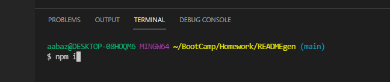
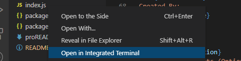
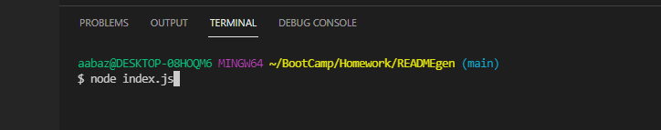

# <ins>README Generator</ins>

## <ins>Description</ins>
A simple README Generator that allows users to input data from the integrated terminal in order to create a template based README file.
## <ins>Table of Contents</ins>
- [Installation](#installation)
- [Usage](#usage)
- [License](#license)
- [Features](#features)
- [Contributions](#contributions)
- [Tests](#tests)
- [Questions](#questions)

## <ins>Installation</ins>
Type "npm i" in the integrated terminal(if all the files do not install, attempt it again)

## <ins>Usage</ins>
Open the integrated terminal on the index.js file

Type in "node index.js" to allow the prompts to populate. Answer the prompts and once complete, the README will save the corresponding answers to the appropriate location in the template

Example of the operation of the generator.

## <ins>License</ins>

This project is covered under MIT
## <ins>Features</ins>
## <ins>Contributions
Fork at will!
## <ins>Tests</ins>
npm test
## <ins>Questions</ins>
Contact README Generator at aabazary@gmail.com. Github link: https://github.com/aabazary
